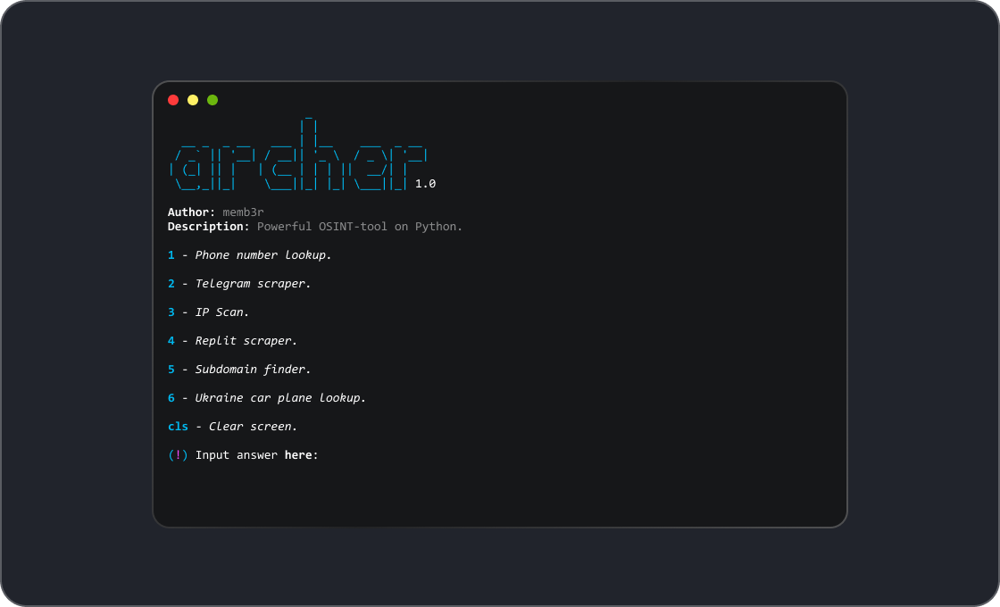

<p align="center">
  
</p>

<p align="center">
    
</p>

<h2>Installation:</h2>

<p>For Ubuntu, Debian (apt):</p>

```bash
$ sudo apt update
$ sudo apt upgrade
$ sudo apt install git python3-pip
$ git clone https://github.com/memb3r/archer
$ cd archer
$ pip install colorama beautifulsoup4 rich
$ python3 archer.py 
```

<p>For Fedora (dnf):</p>

```bash
$ sudo dnf update
$ sudo dnf install git python3-pip
$ git clone https://github.com/memb3r/archer
$ cd archer
$ pip install colorama beautifulsoup4 rich
$ python3 archer.py
```

<p>For openSUSE (zypper):</p>

```bash
$ sudo zypper refresh
$ sudo zypper install git python3-pip
$ git clone https://github.com/memb3r/archer
$ cd archer
$ pip install colorama beautifulsoup4 rich
$ python3 archer.py
```

<p>For Arch (pacman):</p>

```bash
$ sudo pacman -Syu
$ sudo pacman -S git python-pip
$ git clone https://github.com/memb3r/archer
$ cd archer
$ pip install colorama beautifulsoup4 rich
$ python archer.py
```

<p>For Void Linux (xbps):</p>

```bash
$ sudo xbps-install -S git python3-pip
$ git clone https://github.com/memb3r/archer
$ cd archer
$ pip install colorama beautifulsoup4 rich
$ python3 archer.py
```

<h2>Preview:</h2>



<h2>Usage:</h2>

```bash
1 - Phone number lookup.
2 - Telegram scraper.
3 - IP Scan.
4 - Replit scraper
5 - Subdomain finder.
cls - Clear screen.
```
