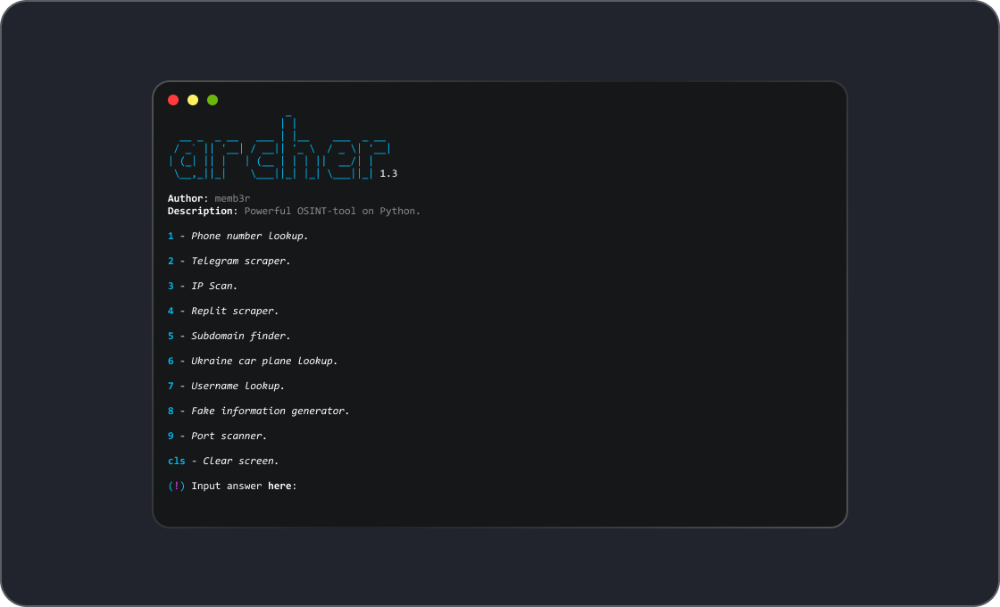

<p align="center">
  
</p>

<p align="center">
  Version: 1.3
</p>

<p align="center">
   
</p>

<p align="center">
  <a href="https://colab.research.google.com/drive/1xpib2dygsEYTFvf0ywkVRMBMZLRLmpGY?usp=sharing">Google Colab Demo</a>
</p>

<h2>Preview:</h2>



<h2>Installation:</h2>

<p>For Ubuntu, Debian (apt):</p>

```bash
$ sudo apt update
$ sudo apt upgrade
$ sudo apt install git python3-pip
$ git clone https://github.com/memb3r/archer
$ cd archer
$ python3 install.py
$ python3 archer.py 
```

<p>For Fedora (dnf):</p>

```bash
$ sudo dnf update
$ sudo dnf install git python3-pip
$ git clone https://github.com/memb3r/archer
$ cd archer
$ python3 install.py
$ python3 archer.py
```

<p>For openSUSE (zypper):</p>

```bash
$ sudo zypper refresh
$ sudo zypper install git python3-pip
$ git clone https://github.com/memb3r/archer
$ cd archer
$ python3 install.py
$ python3 archer.py
```

<p>For Arch (pacman):</p>

```bash
$ sudo pacman -Syu
$ sudo pacman -S git python-pip
$ git clone https://github.com/memb3r/archer
$ cd archer
$ python3 install.py
$ python archer.py
```

<p>For Void Linux (xbps):</p>

```bash
$ sudo xbps-install -S git python3-pip
$ git clone https://github.com/memb3r/archer
$ cd archer
$ python3 install.py
$ python3 archer.py
```

<h2>Usage:</h2>

<li>1 - Phone number lookup.</li>
<li>2 - Telegram scraper.</li>
<li>3 - IP Scan.</li>
<li>4 - Replit scraper</li>
<li>5 - Subdomain finder <i>(9985 subdomains in a list)</i>.</li>
<li>6 - Ukraine car plane lookup <i>(traffic police database)</i>.</li>
<li>7 - Username lookup.</li>
<li>8 - Fake information generator.</li>
<li>9 - Port scanner.</li>
<li>cls - Clear screen.</li>

<h2>Working on (1.3):</h2>
<li><b>Debian and Debian-based</b> (Ubuntu, Zorin OS, Kali Linux, Linux Mint, etc.) ✅</li>
<li><b>Fedora and Fedora-based</b> (openSUSE, CentOS, Oracle Linux, Red Hat, etc.) ❔</li>
<li><b>Arch and Arch-based</b> (Manjaro, SteamOS, etc.)❔</li>
<li><b>Void Linux</b> ❔</li>
<li><b>Alpine Linux</b> ❔</li>
<li><b>Windows</b> ❌</li>
